# How-to mailing list

The main communication channel for the group, when we are not at the periodic meeting, is a mailing list hosted at University of Bath.

The mailing list homepage is [https://lists.bath.ac.uk/sympa/info/oh-research](https://lists.bath.ac.uk/sympa/info/oh-research)

That's an important link, as from the homepage you can subscribe, unsubscribe and change your mailing preferences.

1. [How to subscribe to the list](#How-to-subscribe-to-the-list)
2. [How to send a message to the list](#How-to-send-a-message-to-the-list)
3. [Replying to a message someone sent to the list](#Replying-to-a-message-someone-sent-to-the-list)
4. [Checking the messages archive](#Checking-the-messages-archive)
5. [How to modify your user preferences](#How-to-modify-your-user-preferences)
6. [How to unsubscribe from the list](#How-to-unsubscribe-from-the-list)

## How to subscribe to the list

1. Go to [https://lists.bath.ac.uk/sympa/info/oh-research](https://lists.bath.ac.uk/sympa/info/oh-research)

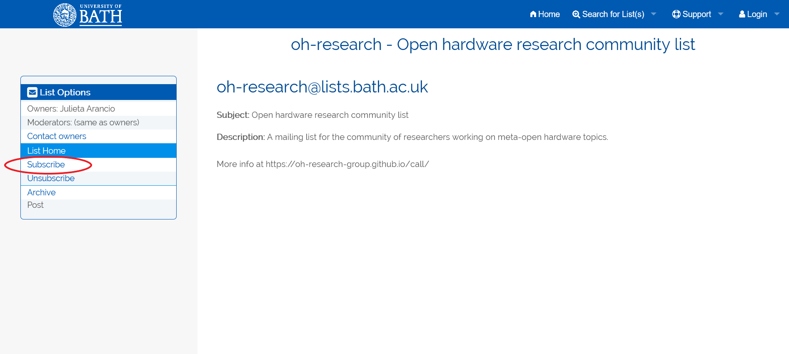

2. Click on subscribe and input your e-mail address and name, then confirm subscription

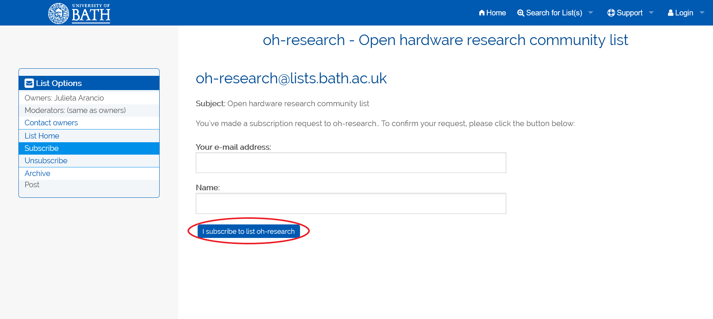

3. Check your email, you should have received a notification like this one:

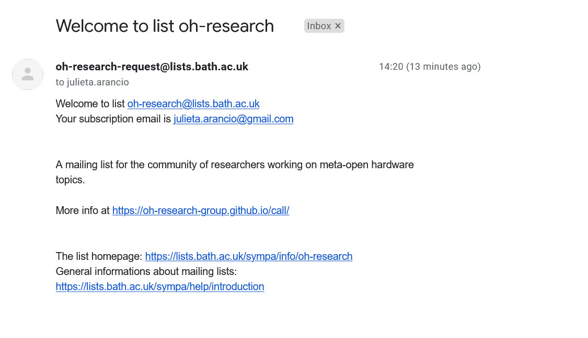

You are subscribed!

## How to send a message to the list

Only subscribers can post messages to the list. 

To send a message, you just have to create a new email from your registered address, and send it to [oh-research@lists.bath.ac.uk](mailto:oh-research@lists.bath.ac.uk)

## Replying to a message someone sent to the list

If you want to reply to a message someone sent to the list, directly hit reply in your email client. By default, this will automatically add two destinataries: the list, and the original sender.

> **Important**: if you want to send a private reply to the original sender, make sure you delete the list address! If not your reply will go to all list subscribers.

## Checking the messages archive

You can see all messages sent to the list from the list homepage. Go to [https://lists.bath.ac.uk/sympa/info/oh-research](https://lists.bath.ac.uk/sympa/info/oh-research) and click on `Archive`.

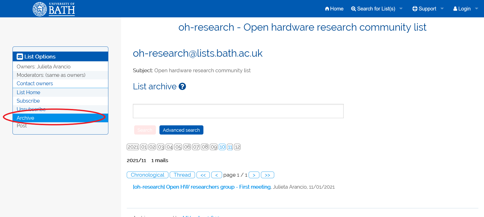

Scroll down to find all posted messages.

## How to modify your user preferences

By default, when you subscribe to the list you will get an email for every message sent to it. You can change this and other data (your name, update your email address, add a picture, etc) from the list homepage.

1. Go to the list homepage 
2. Open the Log-in menu in the upper right corner

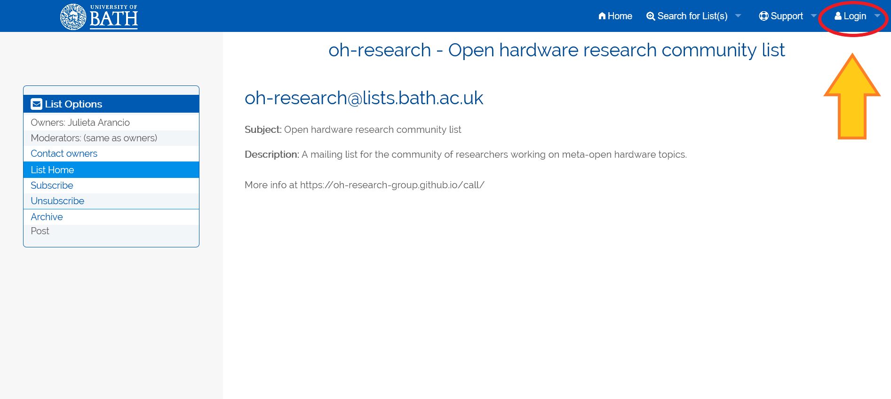

3. Click on `First log in?`

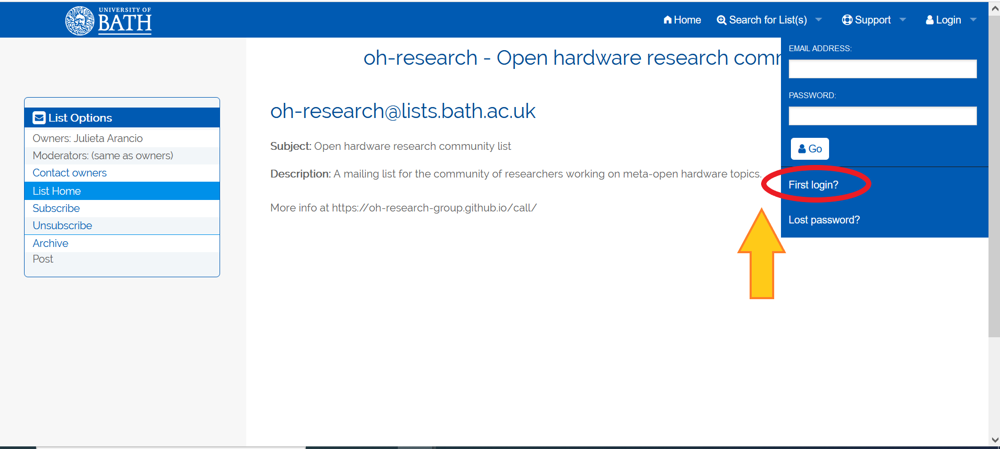

4. Input your e-mail address

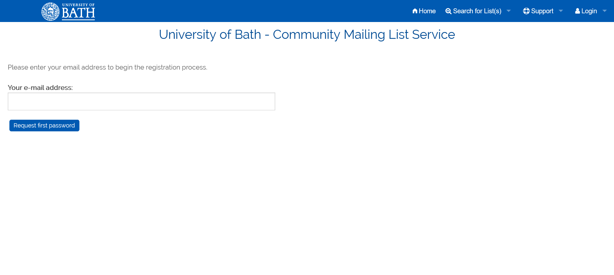

5. Check your email and click on the link you received

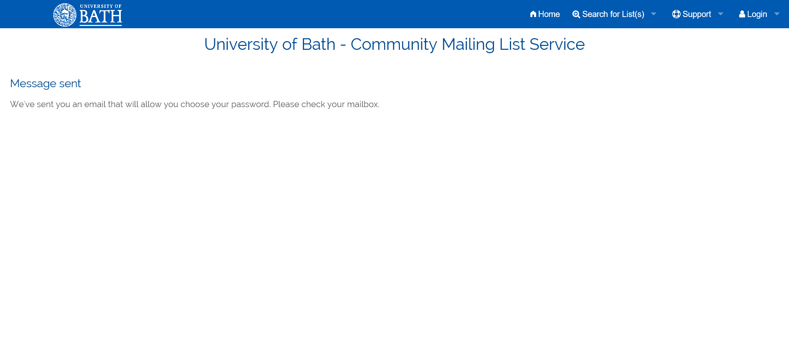

6. Generate a password

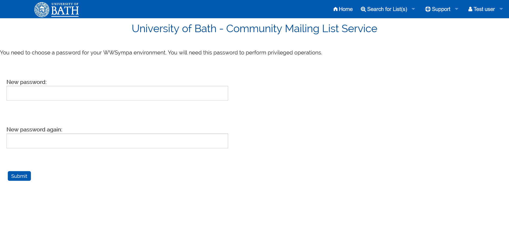

7. You can now change some settings from this page

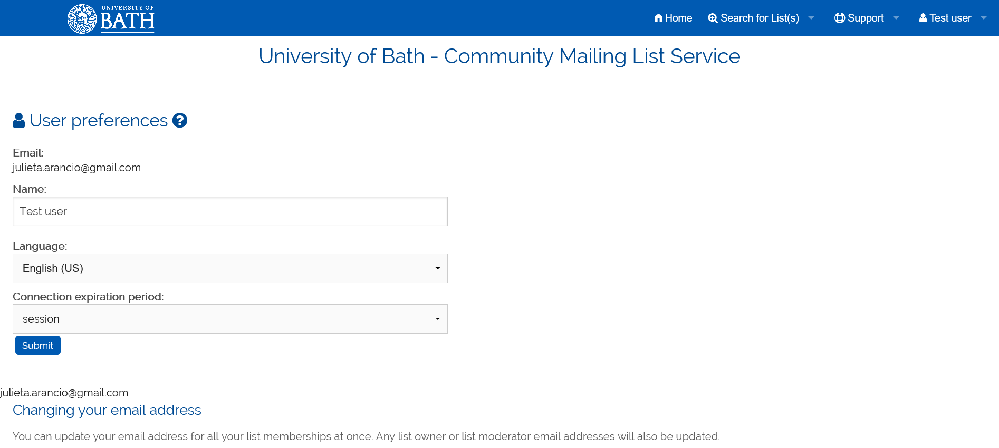

8. For the full list of user preferences, go to the list homepage again (via URL or via `My lists` in the upper right menu) and click on `Subscriber options`

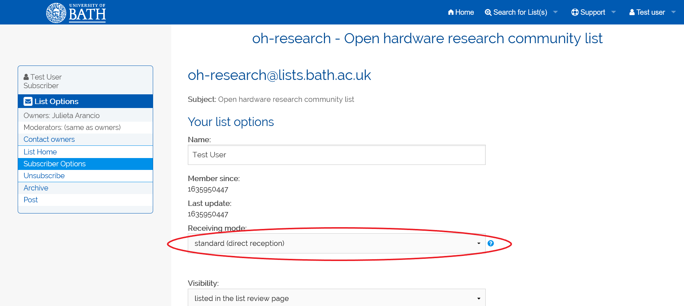

Once in the subscriber options page, you can: 
1. Change your name
2. Update your email address
3. Update how you receive your email: by default the option is "standard", which gets you one email per message sent to the list; you can change this to "summary", which will send you one email per week, every Friday at 10 am, with the list of messages.

This is how the summary looks like, if you click each link under the numbered list it will take you to the respective message:

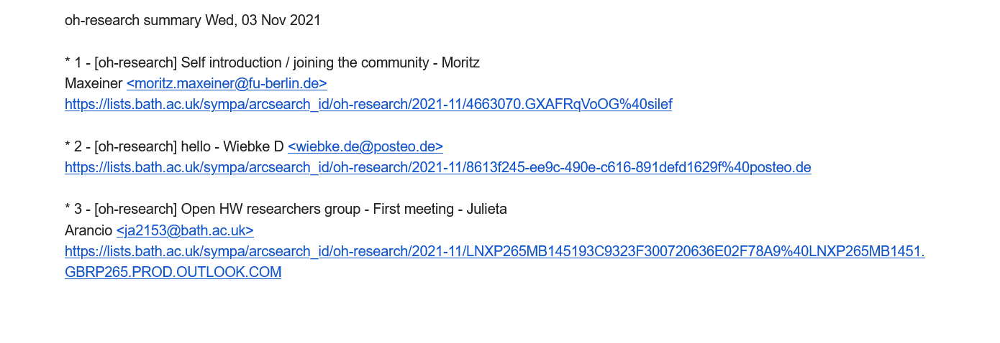

## How to unsubscribe from the list
1. Go to [https://lists.bath.ac.uk/sympa/info/oh-research](https://lists.bath.ac.uk/sympa/info/oh-research)

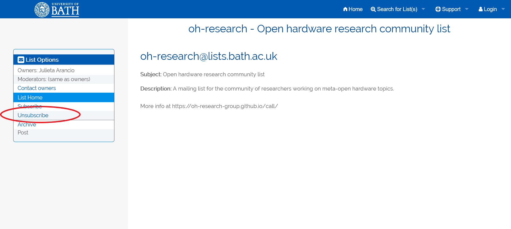

2. Click on unsubscribe and input your e-mail address, then confirm

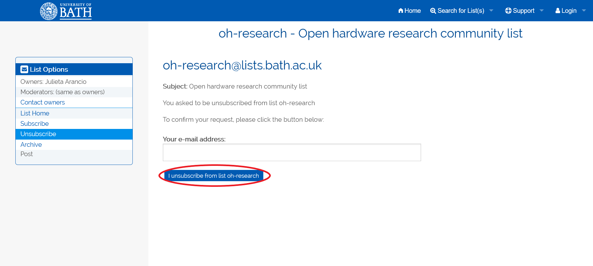

3. Check your email, you should have received a notification like this one:

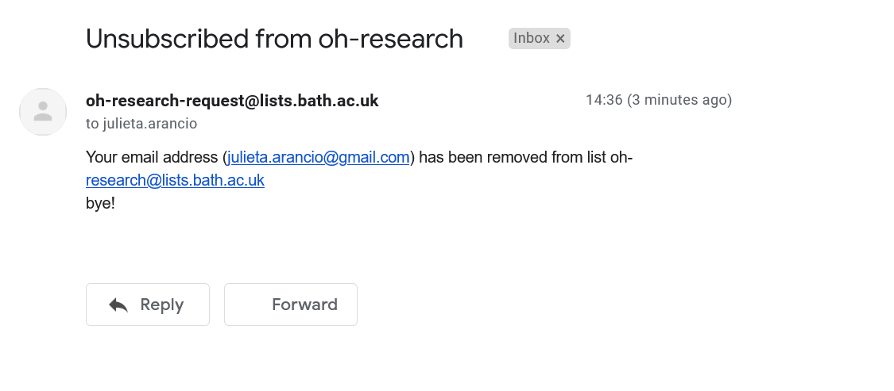

And that's it!
